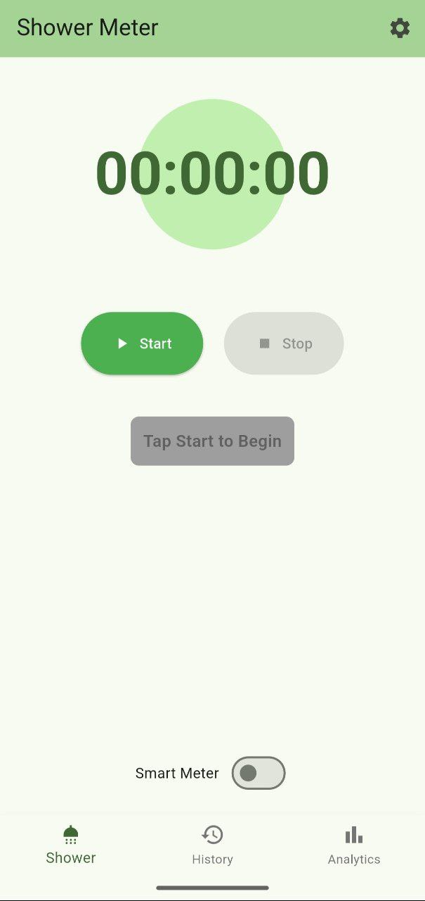
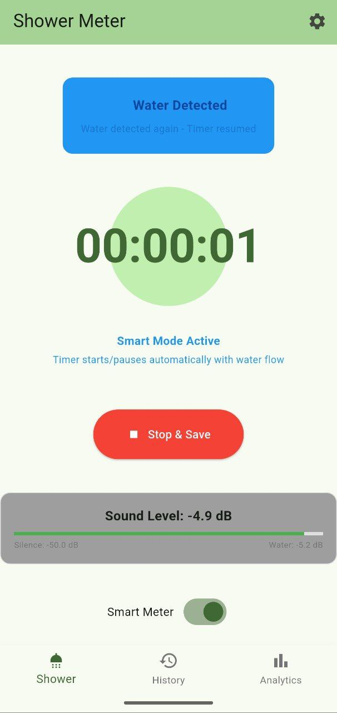
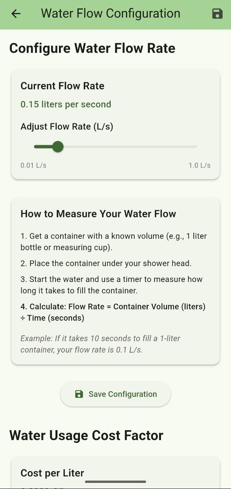
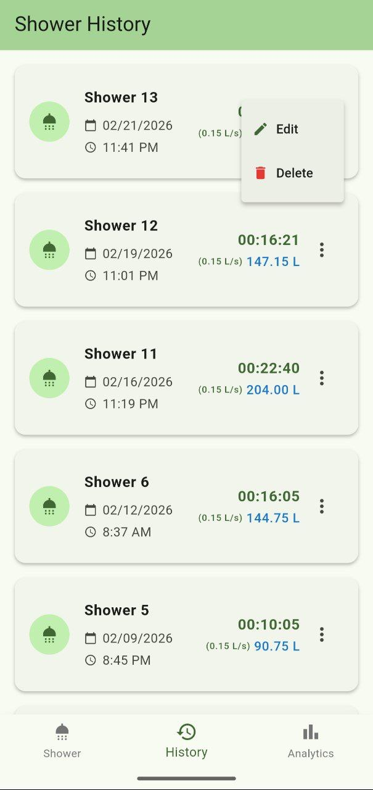
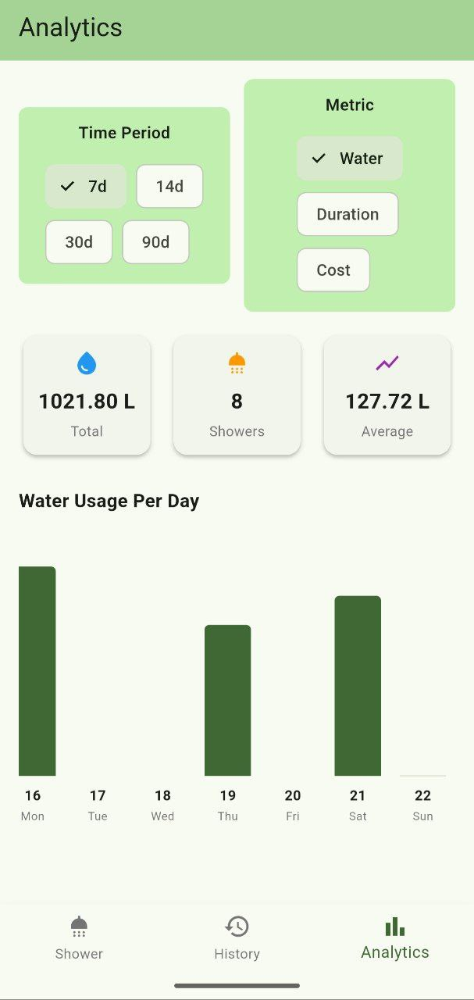
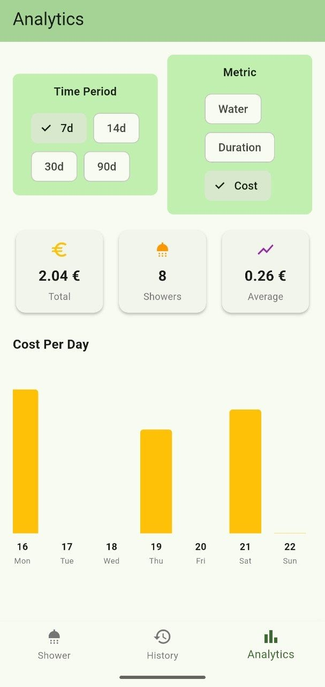

# Smart Shower Meter 🚿

A simple cross-platform application for tracking and analyzing your shower habits.
Monitor how long you spend in the shower, view historical records, and analyze your shower patterns.

## Features ✨

### 📱 Timer Page
- **Start, Pause, Stop Controls** - Full control over your shower timer
- **Large Display** - Easy-to-read timer with HH:MM:SS format
- **Display on** - Display stay on while metering

### 💡 Smart Meter Page
- **Automatic Detection** - Detects shower sounds to auto-start/stop the timer
- **Noise Filtering** - Basic filtering to reduce false positives from background noise

### 📋 History Page
- **Complete Shower Records** - View all your shower sessions
- **Detailed Information** - Date, time, and duration for each shower
- **Edit and Delete** - Adapt configuration for historical records

### 📊 Analytics Page
- **Shower Time Per Day** - Visual bar chart showing daily shower times
- **Summary Statistics** - Overview of time, water usage, or cost
- **Flexible Time Periods** - View data for 7, 14, 30, or 90 days


## Project Structure 📁

```
docs/                            # Further development guides
lib/
├── main.dart                    # App entry point & home page
├── models/
│   ├── shower_record.dart       # ShowerRecord data model
│   └── smart_meter.dart         # Smart meter data model
├── pages/
│   ├── timer_page.dart          # Shower timer interface
│   ├── history_page.dart        # Historical records list
│   ├── analytics_page.dart      # Charts & statistics
│   └── smart_meter_page.dart    # Smart meter & live flow UI
└── services/
   ├── database_service.dart    # Cross-platform data persistence
   └── sound_detection_service.dart # Detects shower sound and triggers timer
└── utils/
   └── formatters.dart          # Shared formatting helpers
```

## Getting Started 🚀

### Prerequisites
- Flutter SDK (3.10.7 or higher)
- Dart SDK (included with Flutter)

### Installation

1. **Clone the repository**
   ```bash
   git clone https://github.com/neo2100/smart_shower_meter.git
   cd smart_shower_meter
   ```

2. **Install dependencies**
   ```bash
   flutter pub get
   ```

3. **Run the app**
   ```bash
   # For web
   flutter run -d chrome
   
   # For Android
   # First run the emulator either by vscode or `flutter emulators` or
   emulator -avd pixel_api_34
   # then when using emulator run the following based on the emulator name
   flutter run -d emulator-5554
   
   # For iOS
   flutter run -d ios
   
   # For Windows
   flutter run -d windows
   
   # For macOS
   flutter run -d macos
   
   # For Linux
   flutter run -d linux
   ```

4. **Run tests**
   ```bash
   flutter test
   ```

5. **Analyze code before pushing**
   ```bash
   flutter analyze
   ```

6. **Format if generated by AI and missed!**
   ```bash
   dart format .
   ```

### Test On Personal Mobile (Android)

If you want to test a modified version

- Enable developer mode in your mobile app
   - Go to Settings -> About phone
   - Click on `Build number` several times (5-6) to enable the developer mode
- Go to Developer options and enable `USB debugging`
- Connect your phone via USB
- Two options to install the app:
   1. If you have Android SDK and want to generate the sdk and install it:

      ```bash
      flutter build apk --release
      adb install build/app/outputs/flutter-apk/app-release.apk
      ```

## Building for Production 📦

### Android
```bash
flutter build apk
# or for App Bundle
flutter build appbundle
```

### iOS
```bash
flutter build ios
```

### Web
```bash
flutter build web
```

#### Web PWA
The web version now supports a PWA install prompt and clearer home screen install guidance.
- On Android Chrome: look for the install banner or use the browser menu → Add to Home screen.
- On Safari / iOS: tap Share → Add to Home Screen.
- For production builds, use:
```bash
flutter build web --pwa-strategy=offline-first
```

### Windows
```bash
flutter build windows
```

### macOS
```bash
flutter build macos
```

### Linux
```bash
flutter build linux
```

## Try it Yourself ❤️

- Quickly access it using [the PWA web version](https://smart-shower-meter.linguly.io/)

or

- Download the [latest apk release](https://github.com/neo2100/smart_shower_meter/releases/tag/latest) and install it on your Android phone

### How to Use 📖

1. **Start a Shower**
   - Navigate to the Timer page (first tab)
   - Tap "Start" to begin timing or switch to smart meter
   - The timer will display your shower duration

<div style="display: flex; gap: 10px;">
   
   
</div>

2. **Configure Your Water Flow and Cost Factor**
   - Tap the configure button top right
   - Adjust the water flow and cost factor accordingly

<div style="display: flex; gap: 10px;">
   
</div>

3. **View Your History**
   - Switch to the History page (second tab)
   - See all your past shower sessions with dates and times
   - Most recent showers appear at the top
   - You can delete or edit the water flow and cost factor per record

<div style="display: flex; gap: 10px;">
   
</div>

4. **Analyze Your Patterns**
   - Go to the Analytics page (third tab)
   - Choose a time period (7, 14, 30, or 90 days)
   - View:
     - Total shower time
     - Total water usage
     - Total shower cost


<div style="display: flex; gap: 10px;">
   
   
</div>

## Data Privacy 🔒

- All data is stored **locally** on your device
- No data is sent to external servers
- No account or login required
- Complete control over your shower data

### Cross-Platform Storage
- ✅ **Android** - Uses SharedPreferences for persistent storage
- ✅ **iOS** - Uses SharedPreferences for persistent storage
- ✅ **Web** - Uses browser localStorage via SharedPreferences
- ✅ **Windows/macOS/Linux** - Uses file-based storage via path_provider

## Contributing 🤝

Contributions are welcome! Feel free to:
- Report bugs
- Suggest new features
- Submit pull requests


## Support 💬

For issues, questions, or suggestions, please open an issue on [GitHub](https://github.com/neo2100/smart_shower_meter/issues).

Other channels to connect:
- [LinkedIn](https://www.linkedin.com/in/mohammad-hadi-shadmehr/)
- [Twitter(X)](https://x.com/stories_by_hadi)
- [Substack](https://hadistories.substack.com/)
- [Mastodon](https://mastodon.social/@stories_by_hadi)
- [Blog](https://shadmehr.eu/)

---

**Made with ❤️ using Flutter**
