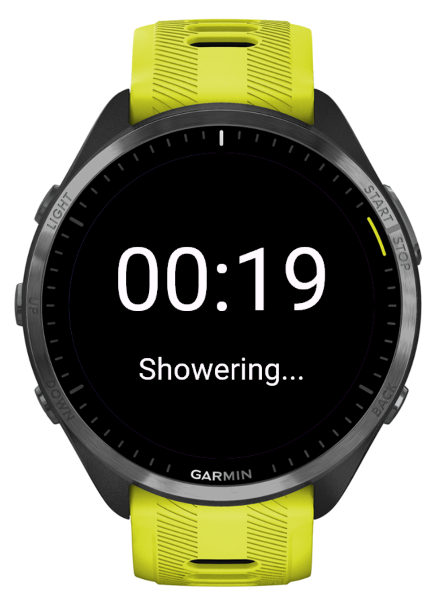

# Smart Shower Meter

**Note:** This repository now includes a Garmin Connect IQ app. For overall project information and build instructions, see the main README: [README.md](../../README.md)

A lightweight Garmin Connect IQ application that measures shower duration using a simple stopwatch interface and sends saved shower records to a companion mobile application.

## Features

* Start and pause a stopwatch using the watch's primary action button
* Save shower duration records
* Send saved records to a companion app via Garmin Connect IQ Communications
* Designed to work on Forerunner 965 and other compatible Garmin devices
* Simple, battery-friendly user interface
* Built using Garmin Connect IQ and Monkey C

---

## Project Structure

```text
SmartShowerMeter/
│
├── manifest.xml
├── monkey.jungle
│
├── source/
│   ├── SmartShowerMeterApp.mc
│   ├── SmartShowerMeterView.mc
│   ├── SmartShowerMeterDelegate.mc
│   ├── MainMenuDelegate.mc
│   ├── StopwatchManager.mc
│   └── SyncManager.mc
│
└── resources/
    ├── strings/
    │   └── strings.xml
    │
    ├── layouts/
    │   └── main.xml
    │
    ├── menus/
    │   └── main_menu.xml
    │
    └── drawables/
```

---

## Requirements

### Software

Install the following:

#### Garmin Connect IQ SDK

Download from:

https://developer.garmin.com/connect-iq/sdk/

#### Java JDK

JDK 11 or newer is recommended.

Verify installation:

```bash
java -version
```

#### Visual Studio Code (Recommended)

Install:

https://code.visualstudio.com/

#### Connect IQ VS Code Extension

Install the Garmin Connect IQ extension from the VS Code marketplace.

#### Garmin Express

Required for installing apps onto a physical watch.

Download:

https://www.garmin.com/express/

---

## Setting Up the SDK

Extract the SDK somewhere convenient:

```text
C:\GarminSDK\
```

or

```text
~/GarminSDK/
```

Set the SDK path in VS Code settings or use it directly with the command-line tools.

Verify the SDK installation:

```bash
monkeyc --version
```

---

## Running in the Simulator

The simulator is the fastest way to test.

### Build

Generate a release package using the extension commands in vscode: `Monkey C: Build for Device`

### Launch Simulator

In VSCode use Command + F5 on Mac, Ctrl + F5 on other platforms

---

## Testing Stopwatch Functionality

{: style="width: 50%;" }

### Start

Touch the screen or click the START/SELECT button in the simulator.

Expected behavior:

* Stopwatch begins counting.

### Pause

Press START/SELECT again.

Expected behavior:

* Stopwatch pauses and shows the menu.

### Resume

Select Resume from the menu.

Expected behavior:

* Stopwatch continues from the paused value.

---

## Testing Save Functionality

Pause the stopwatch to see the menu.

Select:

```text
Save Shower
```

Expected behavior:

* Record is saved.
* Stopwatch resets.
* Communication payload is generated.

Example payload:

```json
{
  "event": "shower_saved",
  "duration_seconds": 185,
  "timestamp": 1717000000
}
```

---

## Testing Communications

The application uses:

```monkeyc
Toybox.Communications
```

To test communications:

1. Pair the watch with Garmin Connect Mobile.
2. Install a companion application.
3. Register for Connect IQ App Events in the companion app.
4. Save a shower session.

Expected result:

The companion app receives a payload similar to:

```json
{
  "event": "shower_saved",
  "duration_seconds": 185,
  "timestamp": 1717000000
}
```

---

## Building an Installable App

[Guide reference](https://www.ottorinobruni.com/getting-started-with-garmin-connect-iq-development-build-your-first-watch-face-with-monkey-c-and-vs-code/)

Generate a release package using the extension commands in vscode: `Monkey C: Build for Device`

Output:

```text
SmartShowerMeter.prg
```

This file can be installed onto compatible Garmin devices.

---

## Installing on a Physical Garmin Watch

Connect the watch via USB.

Copy:

```text
SmartShowerMeter.prg
```

to:

```text
GARMIN/APPS/
```

Safely eject the watch.

Disconnect and restart the watch.

The application should appear in:

```text
Activities & Apps
```

## Creating a Developer Key

A developer key is required for local builds.

Generate one:

```bash
monkeyc -g developer_key.der
```

Store this file securely.

Do not commit it to source control.

Add to .gitignore:

```gitignore
*.der
```

---

## Suggested Development Workflow

1. Make code changes.
2. Build the application.
3. Run in the simulator.
4. Test start/pause behavior.
5. Test save behavior.
6. Test communication payloads.
7. Deploy to physical watch.
8. Test communication with companion app.

---

## Future Roadmap

### Version 1.1

* Vibration feedback on start
* Vibration feedback on save

### Version 1.2

* Offline record queue
* Automatic synchronization
* Retry on connection failure
* Local storage support

### Version 2.0

* Companion Flutter application
* Real-time synchronization
* Historical shower analytics
* Water consumption estimates

---

## License

Internal project for Smart Shower Meter.

Modify and distribute according to your organization's requirements.
